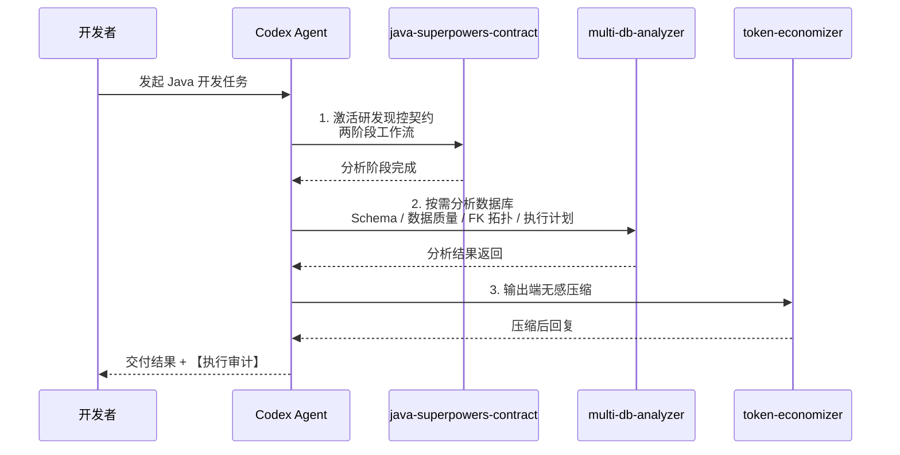
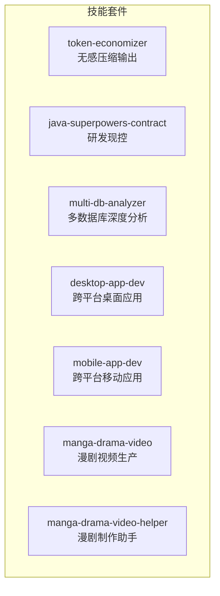

# ai-developer-skill — AI开发者 Codex 技能套件

<p align="center">
  
  
  
  
  
</p>

## 项目简介

**ai-developer-skill** 是一套专为 AI开发者打造的 Codex 技能集合，旨在提升 Codex 在 Java 项目中的数据库分析、研发现控和输出压缩能力。本套件包含七个可独立安装的技能：

| 技能 | 角色 | 关键能力 |
|------|------|----------|
| **multi-db-analyzer** | 多数据库深度分析师 | 15+ 数据库引擎统一分析：Schema、数据质量、FK拓扑、执行计划 |
| **java-superpowers-contract** | 研发现控官 | Git worktree 隔离、四层分析契约、强制审计 |
| **token-economizer** | 输出压缩师 | 无感压缩 Codex 输出，降低 Token 消耗 |
| **desktop-app-dev** | 桌面应用架构师 | 8 步交付 Windows/macOS/Linux 原生桌面应用，自动选型、硬件输入、打包验证 |
| **mobile-app-dev** | 移动应用架构师 | 8 步交付 iOS/Android 等移动应用，自动选型、构建脚本、真机验证 |
| **manga-drama-video** | 漫剧视频导演 | 10 步关卡制漫剧生产，跨集人物锁定、De-AI 审计、配音字幕合成 |
| **manga-drama-video-helper** | 漫剧制作助手 | 剧本分析、素材生成、视频合成三阶段轻量制作，支持系列续写 |

七者可独立安装使用，也可按需串联组合。

---

## 目录结构

```
ai-developer-skill/
+-- README.md
+-- LICENSE
+-- .gitattributes
+-- .gitignore
+-- skills/
|   +-- multi-db-analyzer/              # 多数据库深度查询与分析
|   +-- java-superpowers-contract/     # Java 研发现控契约
|   +-- token-economizer/              # Token 输出压缩器
|   +-- desktop-app-dev/               # 跨平台桌面应用开发
|   +-- mobile-app-dev/                # 跨平台移动应用开发
|   +-- manga-drama-video/             # 漫剧视频生产工作流
|   +-- manga-drama-video-helper/      # 漫剧视频轻量制作助手
```

---

## 安装

**方式一：复制粘贴命令**

```cmd
:: 将 <REPO_DIR> 替换为你本地仓库的实际路径
xcopy /E /I /Y <REPO_DIR>\skills\multi-db-analyzer %USERPROFILE%\.codex\skills\multi-db-analyzer
xcopy /E /I /Y <REPO_DIR>\skills\java-superpowers-contract %USERPROFILE%\.codex\skills\java-superpowers-contract
xcopy /E /I /Y <REPO_DIR>\skills\token-economizer %USERPROFILE%\.codex\skills\token-economizer
xcopy /E /I /Y <REPO_DIR>\skills\desktop-app-dev %USERPROFILE%\.codex\skills\desktop-app-dev
xcopy /E /I /Y <REPO_DIR>\skills\mobile-app-dev %USERPROFILE%\.codex\skills\mobile-app-dev
xcopy /E /I /Y <REPO_DIR>\skills\manga-drama-video %USERPROFILE%\.codex\skills\manga-drama-video
xcopy /E /I /Y <REPO_DIR>\skills\manga-drama-video-helper %USERPROFILE%\.codex\skills\manga-drama-video-helper
```

安装 Python 依赖（按需选装）：
```cmd
pip install pymysql           # MySQL / MariaDB / TiDB
pip install psycopg2-binary   # PostgreSQL
pip install pymssql           # SQL Server
pip install oracledb          # Oracle
pip install redis             # Redis
pip install elasticsearch     # Elasticsearch
pip install pymongo           # MongoDB
pip install influxdb-client   # InfluxDB
pip install qdrant-client     # Qdrant
# SQLite 为内置驱动，无需安装
```

重启 Codex，输入 `"帮我分析数据库"` 验证。

**方式二：对话安装（复制给 Codex）**

```
帮我从仓库 [chichengyu/ai-developer-skill](https://github.com/chichengyu/ai-developer-skill) 安装 multi-db-analyzer、java-superpowers-contract、token-economizer、desktop-app-dev、mobile-app-dev、manga-drama-video 和 manga-drama-video-helper 技能到 ~/.codex/skills/ 目录下
```

---

## 依赖关系


### 技能链调用流程



---

## 技能功能

### multi-db-analyzer — 多数据库深度查询与分析

**核心能力：** 纯 Python 多数据库统一分析工具，支持 15+ 数据库引擎，零 Java 依赖。

**支持的数据库：**

| 类型 | 数据库 |
|------|--------|
| SQL | MySQL / MariaDB / PostgreSQL / SQLite / SQL Server / Oracle / TiDB |
| NoSQL | Redis / Elasticsearch / MongoDB |
| 时序 | InfluxDB / TDengine |
| 向量 | Qdrant / Milvus / DolphinDB |

功能清单：

| 功能 | 说明 | 适用范围 |
|------|------|----------|
| Schema 扫描 | 列出所有表/索引/集合及元数据 | 所有引擎 |
| 数据质量分析 | NULL 率、空串率、哨兵值率三指标 | SQL 引擎 |
| FK 拓扑 | 基于外键构建表依赖关系图 | SQL + MongoDB |
| 表依赖图 | 表间依赖拓扑可视化 | SQL 引擎 |
| 执行计划分析 | EXPLAIN 解读与优化建议 | SQL 引擎 |
| CSV 导出 | 查询结果导出为 CSV | SQL 引擎 |
| PR 报告 | 带快照的变更报告 | SQL 引擎 |
| Java 实体对比 | 对比数据库表与 Java 实体类的字段一致性 | SQL 引擎 |
| 凭据管理 | 首次连接后自动保存到 ~/.multi-db-analyzer-config.json | 所有引擎 |
| 原生查询 | 直接执行原生 SQL / 命令 | 所有引擎 |

**入口：** `scripts/database_query.py`（纯 Python 实现，统一 CLI 接口）

完整命令参考：[multi-db-analyzer](https://github.com/chichengyu/ai-developer-skill/blob/main/skills/multi-db-analyzer/SKILL.md)

---

### java-superpowers-contract — Java 研发现控契约

**核心能力：** 为 Java 项目提供全流程研发现控，强制最小改动、物理隔离与审计跟踪。

> **安装后自动强制无感使用：** 本技能采用零门槛全时激活机制。用户发起任何 Java 开发需求对话时，Codex 在底层自动唤醒 Superpowers 全技能链进行完整分析与规划，无需用户主动提及关键词或手动激活。安装即生效，全程无感。

功能清单：

| 功能 | 说明 |
|------|------|
| Git worktree 物理隔离 | 每次操作在独立 worktree 中完成，主仓库不变 |
| 两阶段工作流 | 分析 → 编码，分析阶段不生成代码 |
| 四层分析协议 | Controller / Service / Repository / Event 逐层审查 |
| 方法级锚定 | [已有] / [新增] 标记，明确代码变更范围 |
| DDL 强制 rollback | 数据库结构变更自动生成回滚脚本 |
| 安全审查 | SQL 注入检测、密钥硬编码检查、API 兼容性检查 |
| 执行审计 | 每次回复附带【执行审计】报告 |

完整命令参考：[java-superpowers-contract](https://github.com/chichengyu/ai-developer-skill/blob/main/skills/java-superpowers-contract/SKILL.md)


---

### token-economizer v3 — 输出压缩器

**核心能力：** 无感压缩 Codex 输出，降低 Token 消耗，提升回复效率。

> **安装后自动强制无感使用：** 本技能采用强制自动激活机制。所有对话、所有会话状态下自动底层加载运行，无需任何关键词，用户全程无感知。本技能在所有其它技能的输出层之上叠加生效，具有最高优先级，跨会话持久，每次启动自动加载。

9 层 18 条铁律：

| 层面 | 规则 |
|------|------|
| 零废话 | 移除冗余描述、客套话、重复内容 |
| 预算裁剪 | 单文件 0 行注释、教学场景 <= 10 行 |
| 超限熔断 | 超出预算标记 `[裁:X行]` 并截断 |
| Java 特化 | 注解直引、签名压缩、异常缩写 |
| 质量门禁 | 自检清单保障压缩不影响语义完整性 |

**依赖：** 零外部依赖，纯指令契约，在输出端对前两者叠加压缩。

完整命令参考：[token-economizer](https://github.com/chichengyu/ai-developer-skill/blob/main/skills/token-economizer/SKILL.md)

---

### desktop-app-dev — 跨平台桌面应用开发

**核心能力：** 8 步交付流程覆盖需求分析、应用分类、框架自动选型、任务拆分、核心实现、打包、验证与移交，支持 Windows / macOS / Linux 原生桌面 GUI 应用。

功能清单：

| 功能 | 说明 |
|------|------|
| 8 步交付流程 | 需求分析 → 分类 → 框架选型 → 任务拆分 → 核心模式 → 打包 → 验证 → 移交 |
| 框架自动选型 | 基于需求画像在 23 个框架中排序，覆盖 WPF / WinUI 3 / Avalonia / SwiftUI / GTK 4 / Qt 6 / Tauri / Electron |
| 硬件输入模板 | Windows `SendInput`、macOS `CGEventPost`、Linux `XTestFakeInputEvent` |
| 窗口枚举模板 | Windows `EnumWindows`、macOS `CGWindowListCopyWindowInfo`、Linux `XQueryTree` |
| 跨架构打包 | win-x64 / win-arm64 / win-x86 / macos-x64 / macos-arm64 / linux-x64 / linux-arm64 |
| 工程模板 | requirements / tasks / release / security 模板、自动更新、DPI manifest |
| 签名与分发 | Windows signtool、macOS codesign / notarytool、deb / rpm / AppImage |
| 验证与移交 | smoke-test fixtures、验证报告、用户 README 与注释 |

完整命令参考：[desktop-app-dev](https://github.com/chichengyu/ai-developer-skill/blob/main/skills/desktop-app-dev/SKILL.md)

---

### mobile-app-dev — 跨平台移动应用开发

**核心能力：** 8 步交付流程覆盖需求分析、应用分类、框架自动选型、任务拆分、平台模式、打包、真机验证与移交，支持 iOS / iPadOS / Android / watchOS / visionOS / Wear OS。

功能清单：

| 功能 | 说明 |
|------|------|
| 8 步交付流程 | 需求分析 → 分类 → 框架自动选型 → 任务拆分 → 平台模式 → 打包 → 真机验证 → 移交 |
| 框架自动选型 | 决策树覆盖 SwiftUI / Kotlin Compose / Flutter / React Native / MAUI / KMP / Capacitor / Tauri Mobile |
| 多平台构建脚本 | xcodebuild / Gradle / Flutter / RN / MAUI / KMP |
| 签名与分发 | codesign、Fastlane、TestFlight / Play Store 轨道 |
| 真机验证 | 真机 / 模拟器验证与验证报告 |
| 工程模板 | requirements checklist、task cards、smoke-test fixtures |

完整命令参考：[mobile-app-dev](https://github.com/chichengyu/ai-developer-skill/blob/main/skills/mobile-app-dev/SKILL.md)

---

### manga-drama-video — 漫剧视频生产工作流

**核心能力：** 严格 10 步关卡制流水线（Step 0-9），把一句话想法变成完整漫剧视频；每一步先写真实产物、暂停等待用户审核，再进入下一步，支持多集系列一致性锁定与 De-AI 审计。

功能清单：

| 功能 | 说明 |
|------|------|
| 10 步关卡制 | 资源登记 → 引擎编排 → 系列锁定 → 剧本 → 人物分析 → 分镜 → 打斗/镜头拆解 → 美术方向 → 图片/场景生成 → 配音/字幕 → 合成/后期 |
| 跨集一致性 | `00_series.json`、character-bible、scene-bible、canonical refs 与 seed 锁定人物/场景/声音 |
| De-AI 审计 | 图片、动作、口型、配音、字幕和成片逐项检查，任何 fail 不得进入下一阶段 |
| 引擎编排 | 云 API 支持 Minimax/Hailuo、即梦/Seedance、豆包；本地支持 ComfyUI + Wan / HunyuanVideo / LTX-Video |
| 风格体系 | 写实动漫、数字真人、经典动漫/美漫/水墨/治愈手绘/赛博朋克/3D 国风仙侠 |
| 审批工具 | `approval_gate.py` 把关、`export_outputs.py` 同步用户指定目录 |

完整命令参考：[manga-drama-video](https://github.com/chichengyu/ai-developer-skill/blob/main/skills/manga-drama-video/SKILL.md)

---

### manga-drama-video-helper — 漫剧视频轻量制作助手

**核心能力：** 面向漫剧、漫画解说、短剧和抖音 9:16 竖屏视频的轻量助手，按深度剧本分析、素材生成、视频合成三个阶段推进，每阶段保存并等待用户明确确认。

功能清单：

| 功能 | 说明 |
|------|------|
| 三阶段工作流 | 深度剧本分析 → 素材生成 → 视频合成 |
| 强制审核关卡 | manifest `phases` 记录 `waiting_script_review` / `waiting_asset_review` / `waiting_video_review` |
| 全自动模式 | `flow_mode: auto_review`，用户只在每个关卡确认或提出修改 |
| 系列续写 | 加载 `00_series.json`、人物/场景表与已批准 refs，下一集承接上一集线索 |
| 模型配置 | 未指定时使用当前模型，切换模型只改配置并记录 manifest |
| 脚本工具 | `init_project.py`、`analyze_script.py`、`seedream_generate.py`、`compose_video.py`、`generate_subtitles.py` |

完整命令参考：[manga-drama-video-helper](https://github.com/chichengyu/ai-developer-skill/blob/main/skills/manga-drama-video-helper/SKILL.md)

---




七者可独立安装。`multi-db-analyzer` 为纯 Python 实现，`java-superpowers-contract` 附带三语言工具链，`token-economizer` 为纯指令契约零依赖；桌面与移动技能提供跨平台工程化交付，漫剧技能覆盖视频生产链路。
