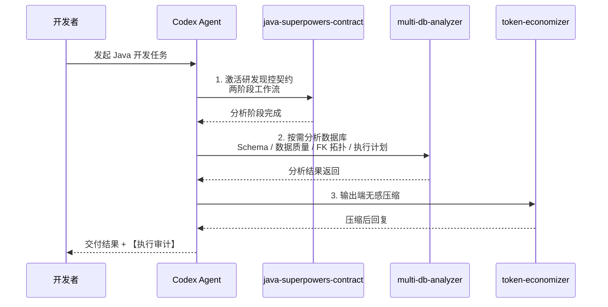
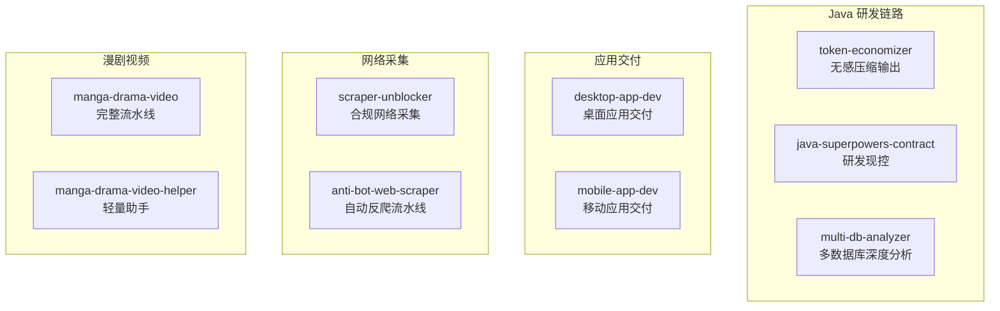

# ai-developer-skills — AI开发者 Codex 技能套件

<p align="center">
  
  
  
  
  
</p>

## 项目简介

**ai-developer-skills** 是一套专为 AI开发者的 Codex 技能集合，覆盖 Java 研发现控、跨平台应用交付与桌面数据流水线、AI 漫剧视频制作和合规网络采集。本套件包含九个可独立安装的技能：

| 技能 | 角色 | 关键能力 |
|------|------|----------|
| **multi-db-analyzer** | 多数据库深度分析师 | 15+ 数据库引擎统一分析：Schema、数据质量、FK拓扑、执行计划 |
| **java-superpowers-contract** | 研发现控官 | Git worktree 隔离、四层分析契约、强制审计 |
| **token-economizer** | 输出压缩师 | 无感压缩 Codex 输出，降低 Token 消耗 |
| **desktop-app-dev** | 跨平台桌面应用架构师 | 8 步交付、24 框架选型、30 线程模板、媒体/Web 数据流水线、内置依赖中心、源码保护打包 |
| **mobile-app-dev** | 移动应用架构师 | 8 步交付、SwiftUI/Compose/Flutter/RN 自动选型、真机验证与上架 |
| **scraper-unblocker** | 合规网络采集助手 | 403/429/JS 挑战/WAF 诊断、robots 合规爬虫、图片/视频/HLS 深爬 |
| **anti-bot-web-scraper** | 深度反爬数据流水线 | 自动多后端反爬：TLS 指纹模拟、Cloudflare/WAF/Turnstile、代理池、媒体/HLS 深爬、JS 签名/设备指纹逆向 |
| **manga-drama-video** | AI 漫剧视频导演 | 10 步审批门禁、跨集一致性、去 AI 味审计、配音/字幕/成片 |
| **manga-drama-video-helper** | 漫剧轻量制作助手 | 三阶段剧本/素材/合成、自动续集、全自动审核模式 |

九个技能既可独立使用，也可按需组合成 Java 研发、应用交付、网络采集和漫剧视频制作链路。

---

## 目录结构

```
ai-developer-skills/
+-- README.md
+-- LICENSE
+-- .gitattributes
+-- .gitignore
+-- skills/
|   +-- multi-db-analyzer/              # 多数据库深度查询与分析
|   +-- java-superpowers-contract/     # Java 研发现控契约
|   +-- token-economizer/              # Token 输出压缩器
|   +-- desktop-app-dev/               # 跨平台桌面应用交付
|   +-- mobile-app-dev/                # 跨平台移动应用交付
|   +-- scraper-unblocker/             # 合规网络采集与媒体深爬
|   +-- anti-bot-web-scraper/          # 自动多后端反爬数据流水线
|   +-- manga-drama-video/             # AI 漫剧视频完整流水线
|   +-- manga-drama-video-helper/      # 漫剧轻量制作助手
```

---

## 安装

**方式一：复制粘贴命令**

```cmd
:: 将 <REPO_DIR> 替换为你本地仓库的实际路径
xcopy /E /I /Y <REPO_DIR>\skills\multi-db-analyzer %USERPROFILE%\.codex\skills\multi-db-analyzer
xcopy /E /I /Y <REPO_DIR>\skills\java-superpowers-contract %USERPROFILE%\.codex\skills\java-superpowers-contract
xcopy /E /I /Y <REPO_DIR>\skills\token-economizer %USERPROFILE%\.codex\skills\token-economizer
xcopy /E /I /Y <REPO_DIR>\skills\desktop-app-dev %USERPROFILE%\.codex\skills\desktop-app-dev
xcopy /E /I /Y <REPO_DIR>\skills\mobile-app-dev %USERPROFILE%\.codex\skills\mobile-app-dev
xcopy /E /I /Y <REPO_DIR>\skills\scraper-unblocker %USERPROFILE%\.codex\skills\scraper-unblocker
xcopy /E /I /Y <REPO_DIR>\skills\anti-bot-web-scraper %USERPROFILE%\.codex\skills\anti-bot-web-scraper
xcopy /E /I /Y <REPO_DIR>\skills\manga-drama-video %USERPROFILE%\.codex\skills\manga-drama-video
xcopy /E /I /Y <REPO_DIR>\skills\manga-drama-video-helper %USERPROFILE%\.codex\skills\manga-drama-video-helper
```

安装 Python 依赖（按需选装）：
```cmd
pip install pymysql           # MySQL / MariaDB / TiDB
pip install psycopg2-binary   # PostgreSQL
pip install pymssql           # SQL Server
pip install oracledb          # Oracle
pip install redis             # Redis
pip install elasticsearch     # Elasticsearch
pip install pymongo           # MongoDB
pip install influxdb-client   # InfluxDB
pip install qdrant-client     # Qdrant
# SQLite 为内置驱动，无需安装
```

重启 Codex 后，可按需输入 `"帮我分析数据库"`、`"帮我做一个桌面应用"`、`"帮我做一个移动应用"`、`"帮我抓取网站或媒体"` 或 `"做一条漫剧视频"` 验证对应技能。

**方式二：对话安装（复制给 Codex）**

```
帮我从仓库 [chichengyu/ai-developer-skills](https://github.com/chichengyu/ai-developer-skills) 安装 multi-db-analyzer、java-superpowers-contract、token-economizer、desktop-app-dev、mobile-app-dev、scraper-unblocker、anti-bot-web-scraper、manga-drama-video 和 manga-drama-video-helper 技能到 ~/.codex/skills/ 目录下
```

---

## 依赖关系


### 技能链调用流程



### 应用与内容创作链路

`desktop-app-dev` 与 `mobile-app-dev` 可独立完成从需求分析、框架选型到打包验证、交付的完整流程；`desktop-app-dev` 同时提供媒体采集、HLS 下载、Web 数据采集处理、转码发布、内置依赖中心与源码保护模板；`scraper-unblocker` 负责常规合规网站与媒体深爬，`anti-bot-web-scraper` 在 Cloudflare/WAF/Turnstile 等复杂反爬场景提供自动多后端升级流水线与深度 JS 签名/设备指纹逆向，可与桌面应用采集链路配合；`manga-drama-video` 提供 10 步审批门禁的完整漫剧视频流水线，`manga-drama-video-helper` 提供更轻量的三阶段版本。需要更严格的跨集一致性锁和 De-AI 审计时，可把 helper 产物转交 `manga-drama-video` 继续生产。

---

## 技能功能

### multi-db-analyzer — 多数据库深度查询与分析

**核心能力：** 纯 Python 多数据库统一分析工具，支持 15+ 数据库引擎，零 Java 依赖。

**支持的数据库：**

| 类型 | 数据库 |
|------|--------|
| SQL | MySQL / MariaDB / PostgreSQL / SQLite / SQL Server / Oracle / TiDB |
| NoSQL | Redis / Elasticsearch / MongoDB |
| 时序 | InfluxDB / TDengine |
| 向量 | Qdrant / Milvus / DolphinDB |

功能清单：

| 功能 | 说明 | 适用范围 |
|------|------|----------|
| Schema 扫描 | 列出所有表/索引/集合及元数据 | 所有引擎 |
| 数据质量分析 | NULL 率、空串率、哨兵值率三指标 | SQL 引擎 |
| FK 拓扑 | 基于外键构建表依赖关系图 | SQL + MongoDB |
| 表依赖图 | 表间依赖拓扑可视化 | SQL 引擎 |
| 执行计划分析 | EXPLAIN 解读与优化建议 | SQL 引擎 |
| CSV 导出 | 查询结果导出为 CSV | SQL 引擎 |
| PR 报告 | 带快照的变更报告 | SQL 引擎 |
| Java 实体对比 | 对比数据库表与 Java 实体类的字段一致性 | SQL 引擎 |
| 凭据管理 | 首次连接后自动保存到 ~/.multi-db-analyzer-config.json | 所有引擎 |
| 原生查询 | 直接执行原生 SQL / 命令 | 所有引擎 |

**入口：** `scripts/database_query.py`（纯 Python 实现，统一 CLI 接口）

完整命令参考：[multi-db-analyzer](https://github.com/chichengyu/ai-developer-skills/blob/main/skills/multi-db-analyzer/SKILL.md)

---

### java-superpowers-contract — Java 研发现控契约

**核心能力：** 为 Java 项目提供全流程研发现控，强制最小改动、物理隔离与审计跟踪。

> **安装后自动强制无感使用：** 本技能采用零门槛全时激活机制。用户发起任何 Java 开发需求对话时，Codex 在底层自动唤醒 Superpowers 全技能链进行完整分析与规划，无需用户主动提及关键词或手动激活。安装即生效，全程无感。

功能清单：

| 功能 | 说明 |
|------|------|
| Git worktree 物理隔离 | 每次操作在独立 worktree 中完成，主仓库不变 |
| 两阶段工作流 | 分析 → 编码，分析阶段不生成代码 |
| 四层分析协议 | Controller / Service / Repository / Event 逐层审查 |
| 方法级锚定 | [已有] / [新增] 标记，明确代码变更范围 |
| DDL 强制 rollback | 数据库结构变更自动生成回滚脚本 |
| 安全审查 | SQL 注入检测、密钥硬编码检查、API 兼容性检查 |
| 执行审计 | 每次回复附带【执行审计】报告 |

完整命令参考：[java-superpowers-contract](https://github.com/chichengyu/ai-developer-skills/blob/main/skills/java-superpowers-contract/SKILL.md)


---

### token-economizer v3 — 输出压缩器

**核心能力：** 无感压缩 Codex 输出，降低 Token 消耗，提升回复效率。

> **安装后自动强制无感使用：** 本技能采用强制自动激活机制。所有对话、所有会话状态下自动底层加载运行，无需任何关键词，用户全程无感知。本技能在所有其它技能的输出层之上叠加生效，具有最高优先级，跨会话持久，每次启动自动加载。

9 层 18 条铁律：

| 层面 | 规则 |
|------|------|
| 零废话 | 移除冗余描述、客套话、重复内容 |
| 预算裁剪 | 单文件 0 行注释、教学场景 <= 10 行 |
| 超限熔断 | 超出预算标记 `[裁:X行]` 并截断 |
| Java 特化 | 注解直引、签名压缩、异常缩写 |
| 质量门禁 | 自检清单保障压缩不影响语义完整性 |

**依赖：** 零外部依赖，纯指令契约，在输出端对前两者叠加压缩。

完整命令参考：[token-economizer](https://github.com/chichengyu/ai-developer-skills/blob/main/skills/token-economizer/SKILL.md)

---

### desktop-app-dev — 跨平台桌面应用交付

**核心能力：** 为 Windows / macOS / Linux 原生桌面 GUI 应用提供 8 步交付流程，覆盖需求分析、应用分类、框架选型、任务拆解、核心模式、打包、验证和交付，并内置媒体采集/HLS/发布、Web 数据采集/处理流水线、内置依赖中心、自动反爬升级与源码保护。

功能清单：

| 功能 | 说明 |
|------|------|
| 8 步交付流程 | 需求分析 → 分类 → 选型 → 任务拆解 → 核心模式 → 打包 → 验证 → 交付 |
| 24 框架选型引擎 | `select_framework.py` 对需求 brief 打分并输出 Top 3 与理由 |
| 环境自动安装 | `bootstrap_environment.ps1` 默认 DryRun 检测，显式 `-Install` 才安装所选框架工具链 |
| 硬件输入模板 | SendInput / CGEventPost / XTestFakeInputEvent，禁止 PostMessage 与内存写入 |
| 窗口枚举模板 | EnumWindows / Quartz / X11 带 3 秒超时与会话缓存 |
| 线程化模板 | 30 个模板（22 单任务 + 8 有界线程池），覆盖 WPF / WinUI / tkinter / PySide6 / Tauri 等 |
| UI 硬性要求 | UI-01..UI-19 强制验收（启动页、列表进度条、内置依赖中心等），未显式豁免不得跳过 |
| 最小改动要求 | CODE-01..CODE-05 强制保留原逻辑、最小 diff，豁免须记录 |
| 内置依赖中心 | `dependency_center.py` / `builtin_dependency_manager.py` 按 manifest 提供一键安装，可自动配置 Playwright / ffmpeg / pycryptodome 等应用内依赖 |
| 媒体采集与发布 | `media_*` / HLS 下载 / task_queue / ffmpeg 转码 / 平台发布 / HTTP sidecar |
| Web 数据流水线 | API 抓取/分析、深爬、Cloudflare/安全识别、代理池、多账号、定时任务、通知；`smart_fetch.py` 自动多后端反爬，`flaresolverr.py` / `stealth_browser.py` 浏览器级升级 |
| 多语言 Sidecar | `media_pipeline_service.py` + `clients/` 八语言封装，任意桌面 UI 可调用 |
| 源码保护 | 打包前 `-BackupSource` 生成时间戳源码 zip，构建脚本不删除源码 |
| 打包脚本 | 14 个 `build_*.ps1` + DMG / AppImage / deb 助手，覆盖主流架构 |
| 签名与更新 | Authenticode / codesign / notarytool，Velopack / Squirrel / Sparkle 自动更新 |
| 验证与交付 | 三平台 smoke test、架构感知测试、用户 README 与交付清单 |

**依赖：** 按所选框架安装对应工具链（.NET / Rust / Python / Go / Kotlin / Swift 等），模板自带 PyInstaller、dotnet publish、Tauri 等打包方案；构建工具链默认 DryRun，显式 `-Install` 才安装；媒体/Web 可选依赖可通过 `ensure_all_dependencies.py` / `ensure_web_fetch_dependencies.py` 或内置依赖中心按需检测安装。

完整命令参考：[desktop-app-dev](https://github.com/chichengyu/ai-developer-skills/blob/main/skills/desktop-app-dev/SKILL.md)

---

### mobile-app-dev — 跨平台移动应用交付

**核心能力：** 覆盖 iOS / iPadOS / Android / watchOS / visionOS / Wear OS 的 8 步移动应用交付流程，通过确定性决策树自动选择 Swift/SwiftUI、Kotlin/Compose、Flutter、React Native、.NET MAUI、Kotlin Multiplatform、Capacitor 或 Tauri Mobile。

功能清单：

| 功能 | 说明 |
|------|------|
| 8 步交付流程 | 需求分析 → 分类 → 自动选型 → 任务拆解 → 平台模式 → 打包 → 真机验证 → 交付 |
| 确定性自动选型 | 决策树输出单平台、双平台或跨平台框架并记录理由 |
| SDK 自动安装 | `setup_toolchain.py` 检测并安装 Xcode / Android Studio / Flutter / RN / .NET 等工具链 |
| 平台深度模板 | SwiftUI / Compose / Flutter / RN / MAUI / KMP / Capacitor / Tauri 多语言样例 |
| 打包与签名 | xcodebuild / Gradle / Fastlane / 证书与 provisioning 配置 |
| 验证清单 | 冷启动、权限、深链、暗黑模式、真机性能与上架检查 |
| 合规与运维 | App Store / Play 政策、隐私合规、崩溃分析、CI/CD 模板 |

**依赖：** 按所选框架安装 Xcode / Android Studio / Flutter / RN / .NET 等工具链；`verify_mobile.ps1` 可自动生成验证报告。

完整命令参考：[mobile-app-dev](https://github.com/chichengyu/ai-developer-skills/blob/main/skills/mobile-app-dev/SKILL.md)

### scraper-unblocker — 合规网络采集与媒体深爬

**核心能力：** 专业网络采集助手，自动诊断 403 / 429 / 503、JS 挑战、Cookie 墙与 WAF 等反爬信号，在合规边界内构建爬虫并深爬图片、视频与 HLS 流，支持按剧集/剧名分类。

功能清单：

| 功能 | 说明 |
|------|------|
| 阻断信号诊断 | `scraper_probe.py` 检查 robots.txt、sitemap、状态码、响应头与封锁启发式并给出下一步 |
| 合规爬虫模板 | `scraper_runner.py` 内置 robots 检查、重试退避、限速、同域遍历与 JSONL 增量输出 |
| 媒体深爬 | `media_runner.py` 按 sitemap 发现图片/视频/音频，按剧名分类并写出 `media_index.jsonl` |
| 媒体探测 | `media_probe.py` 提取标题、Open Graph / JSON-LD 元数据、内联状态与资源 URL |
| 登录会话 | `session_capture.py` 自动填写用户自己的登录表单，保存 cookies 供其它工具复用 |
| 合规边界 | 不绕过认证/付费墙/CAPTCHA，挑战页记为 `BLOCKED`，加密 HLS 记为 `PROTECTED` |

**依赖：** Python 3.8+ 标准库即可运行；可选 Playwright / Selenium 渲染 JS 页面，ffmpeg 用于 HLS 合并。

完整命令参考：[scraper-unblocker](https://github.com/chichengyu/ai-developer-skills/blob/main/skills/scraper-unblocker/SKILL.md)

---

### anti-bot-web-scraper — 自动多后端反爬数据流水线

**核心能力：** 从普通 HTTP 请求开始，按目标封锁类型自动升级后端：TLS 指纹模拟、Cloudflare/WAF/Turnstile 挑战处理、stealth 浏览器循环，直到返回可用 HTML 或 API JSON；默认 `auto` 模式在无验证码 API Key 时仍可运行，浏览器自动点击非交互挑战并自动发现/安装本地 OCR。同时覆盖代理池、登录会话、媒体/HLS/DASH/Smooth 深爬、容器元数据与字幕解析、CSS/JS/字体/数据资源爬取、API 发现与参数自动识别、WebSocket/SSE 与 DOM/JS 事件捕获、数据处理、指标与守护进程运行。深度 JS 逆向（签名/时间戳/设备指纹、反混淆、数据流与运行时请求栈捕获）是采集流水线的强制阶段，每次运行输出 `reverse_report.json`，绕过仍被封锁时会自动重建签名请求重试。

功能清单：

| 功能 | 说明 |
|------|------|
| 自适应 HTTP 后端 | `smart_fetch.py` 在 curl_cffi / cloudscraper / httpx / 标准库之间自动切换，缺失依赖首次使用时按需安装 |
| 完整采集流水线 | `web_data_pipeline.py` 用一份 JSON 配置完成采集、处理与输出 |
| Cloudflare 深处理 | `cloudflare_challenge.py` / `turnstile_solver.py` / `challenge_cookie_bank.py` 处理 Managed Challenge、Turnstile 与 cf_clearance；无 Key 时浏览器自动点击非交互挑战 |
| 浏览器级升级 | `stealth_browser.py` / `flaresolverr.py` / `browser_session.py` 提供 Patchright / nodriver / DrissionPage / FlareSolverr 与独立浏览器容器 |
| WAF 与验证码 | `waf_vendor.py` 分类厂商 WAF；验证码队列、滑块与音频处理；本地 OCR 自动发现并安装 ddddocr / rapidocr / easyocr / paddleocr / cnocr / pytesseract |
| 生产级采集 | 代理池、多账号登录、限速重试、任务守护进程、运行摘要 |
| 媒体与资源深爬 | 图片/视频/音频与 HLS/DASH/Smooth 流获取，支持断点续爬；解析容器元数据与 WebVTT/SRT/ASS 字幕，爬取 CSS/JS/字体/数据资源 |
| 全站与多站爬取 | 单 URL 自动生成全站任务并深爬子页/API；`multi_site_pipeline.py` 并行隔离执行多站，含风险感知限速、站点级重试与阻断恢复/后端轮换 |
| API 发现与处理 | 页面/API 分析（JS body、GraphQL、WebSocket/SSE）、API 客户端分页、头部指纹、子页参数自动增强、全站 API 索引、响应驱动参数链、声明式数据清洗与 JSON/JSONL/CSV 输出 |
| 实时事件捕获 | WebSocket/SSE 帧与事件捕获，DOM/JS 事件发现，浏览器事件触发与 storage 参数提取 |
| 深度 JS 逆向 | `deep_reverse.py` / `reverse_lab.py` 对每个捕获页面与全部捕获做反混淆、签名/时间戳/设备指纹、数据流与 source-map 分析，强制输出 `reverse_report.json` |
| 运行时深钩子 | `deep_hook.py` 自适应捕获 fetch/XHR 请求栈、WebSocket 帧与设备快照；受保护/封锁页默认不注入，`reverse.hook` 可强制或关闭 |
| 签名重建与重试 | 绕过仍被封锁时自动用逆向签名构造请求重试，短密钥可暴力（默认 2 字符）；成功回写为恢复捕获，API 风险按端点隔离 |
| 高级逆向工具箱 | `function_probe.py` / `cdp_probe.py` / `coverage_probe.py` 做函数级与断点级调用捕获；`bundle_runner.py` / `wasm_hook.py` 执行并探测 bundle/WASM；`symbolic_probe.py` / `concolic_runner.py` 追踪签名依赖 |
| 签名知识库与会话重放 | `signature_knowledge.py` 跨站点持久化已验证配方并自动过期/迁移；`replay_client.py` 保持同一会话身份重放签名请求 |
| 验收与依赖 | `acceptance_suite.py` 真实站点验收基线；`ensure_web_fetch_dependencies.py` 一键检测/安装 HTTP/OCR/浏览器可选依赖，`auto` 模式首次使用自动补齐 |
| 合规边界 | 采集前确认授权，遵守 robots 与平台条款，凭据本地加密，默认限速并记录失败 |

**依赖：** Python 3.8+；`smart_fetch.py` 可选 curl_cffi / cloudscraper / httpx，浏览器级能力可选 Patchright / nodriver / DrissionPage / FlareSolverr，验证码 OCR 可选 ddddocr / rapidocr_onnxruntime / easyocr / paddleocr / cnocr / pytesseract，可通过 `ensure_web_fetch_dependencies.py` 自动检测安装；深度逆向可选 jsbeautifier / cryptography（`reverse` 可选依赖组），z3 / wabt / mitmproxy 由 `ensure_reverse_tools.py` 按需安装，Node.js 用于 bundle 执行与回放；`auto` 模式首次使用时按需补齐缺失依赖。

完整命令参考：[anti-bot-web-scraper](https://github.com/chichengyu/ai-developer-skills/blob/main/skills/anti-bot-web-scraper/SKILL.md)

---

### manga-drama-video — AI 漫剧视频完整流水线

**核心能力：** 严格门禁的 10 步流水线，从一句话创意到成品漫剧视频，覆盖资源摄入、引擎编排、系列连续性锁定、剧本、人物分析、分镜、美术方向、图片与场景生成、配音、字幕、最终合成和 FFmpeg/VapourSynth 后期。

功能清单：

| 功能 | 说明 |
|------|------|
| 10 步审批门禁 | Step 0-9 每步产出真实文件并暂停等待 `approve` / `revise` |
| 跨集一致性锁 | `00_series.json`、人物/场景 bible、canonical refs 与 seed 锁定 |
| 去 AI 味审计 | 图片、动作、口型、配音、字幕、成片逐项 De-AI Audit |
| 引擎编排 | 云 API 与本地 ComfyUI 统一写入 `engine_plan.json`，禁止静默降级 |
| 真动态优先 | 默认 video-diffusion，说话镜头音频驱动口型，Ken Burns 仅作降级 |
| 素材与成片 | 图片、视频、配音、BGM、SRT、最终合成与增强 |
| 脚本化门禁 | `approval_gate.py` 提供 check / approve / revise 三态审批 |

**依赖：** FFmpeg、VapourSynth 及当前配置的图片/视频/配音模型 API；本地 ComfyUI + Wan / HunyuanVideo / LTX-Video 可选。

完整命令参考：[manga-drama-video](https://github.com/chichengyu/ai-developer-skills/blob/main/skills/manga-drama-video/SKILL.md)

---

### manga-drama-video-helper — 漫剧轻量制作助手

**核心能力：** 面向漫剧、漫画解说、短剧和抖音 9:16 竖屏视频的三阶段轻量制作助手，从一句话故事、完整剧本或已有素材出发，自动完成剧本、素材和视频交付。

功能清单：

| 功能 | 说明 |
|------|------|
| 三阶段流程 | 深度剧本分析 → 素材生成 → 视频合成，每阶段保存并审核 |
| 强制审核关卡 | `manifest.json` 记录 waiting_script_review / waiting_asset_review / waiting_video_review |
| 全自动模式 | `flow_mode: auto_review`，用户只负责确认或提出修改 |
| 系列续集 | 自动承接上一集结尾、线索、角色/场景状态与 refs |
| 素材生成 | 人物/场景图、配音、BGM、音效、运镜与打斗方案 |
| 视频合成 | 图生视频、嘴型同步、电影级运镜、中英双语字幕烧录 |
| 可交付产出 | 输出到用户指定目录并在 manifest 登记路径与来源 |

**依赖：** 当前模型/API 与 FFmpeg；可选 Seedream、即梦 Seedance、MiniMax-Hailuo 等云引擎。

完整命令参考：[manga-drama-video-helper](https://github.com/chichengyu/ai-developer-skills/blob/main/skills/manga-drama-video-helper/SKILL.md)

---




九个技能均可独立安装。`multi-db-analyzer` 为纯 Python 实现，`java-superpowers-contract` 附带三语言工具链，`token-economizer` 为纯指令契约零依赖；`desktop-app-dev` 提供跨平台桌面交付、媒体与 Web 数据流水线模板，`mobile-app-dev` 提供跨平台移动应用打包与验证模板，`scraper-unblocker` 负责常规合规网络采集与媒体深爬，`anti-bot-web-scraper` 负责 Cloudflare/WAF/Turnstile 等复杂反爬场景的自动多后端流水线与深度 JS 签名/设备指纹逆向，`manga-drama-video` 与 `manga-drama-video-helper` 负责 AI 漫剧视频制作。
